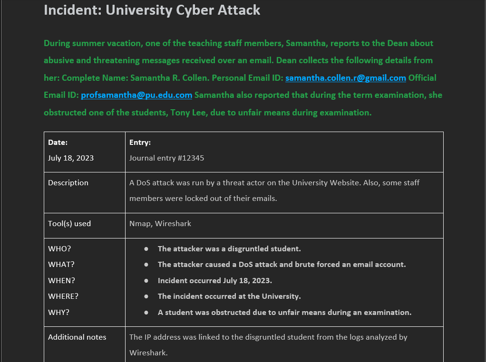
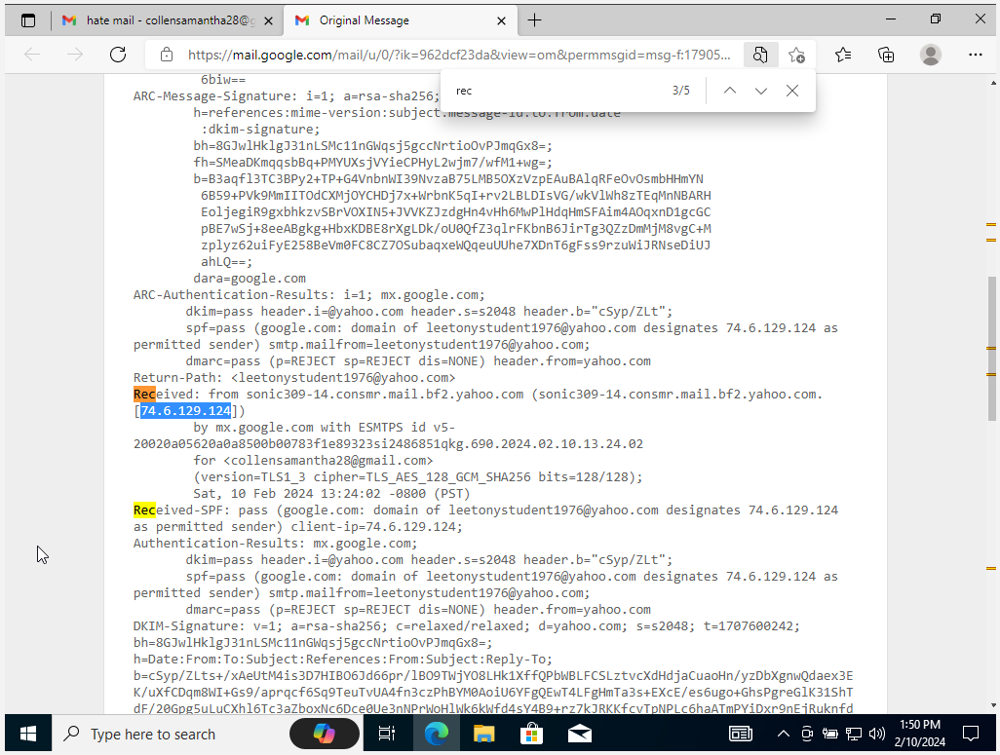
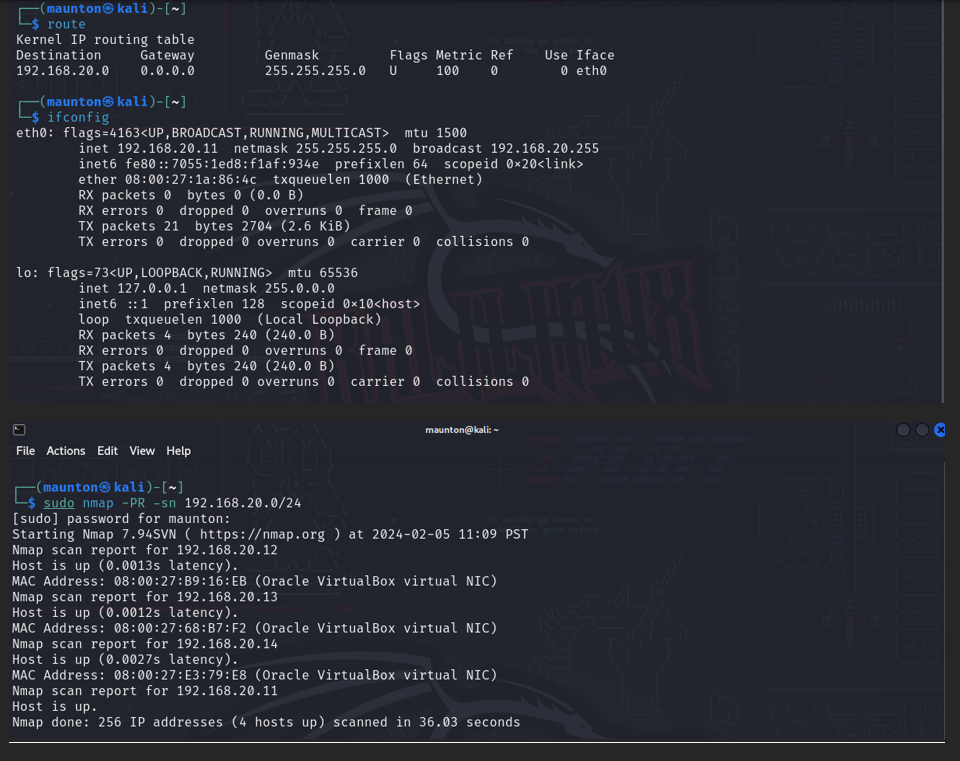
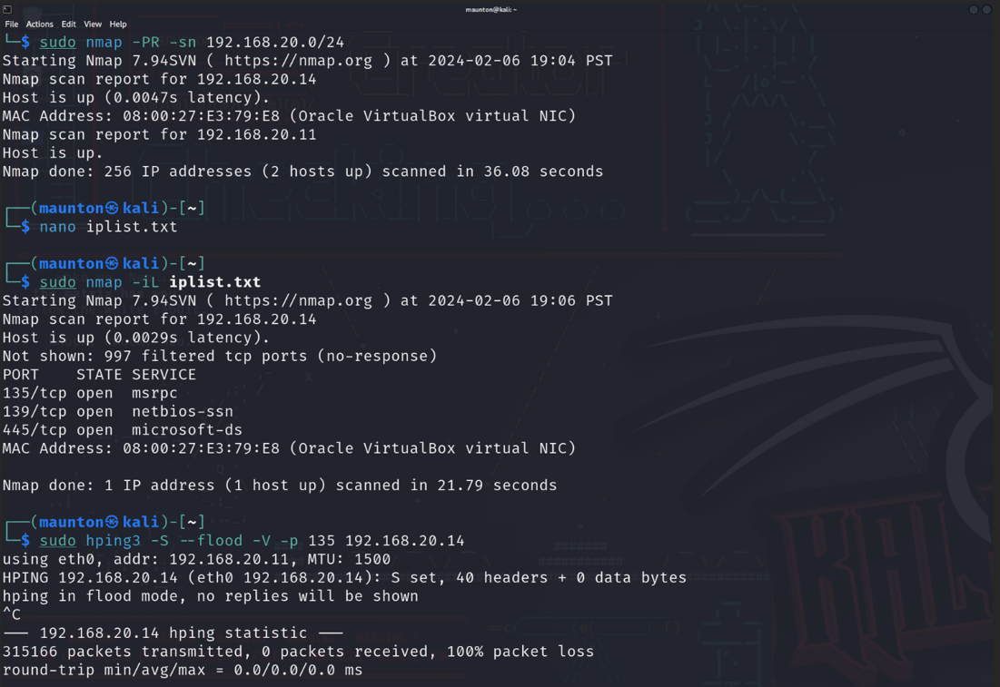
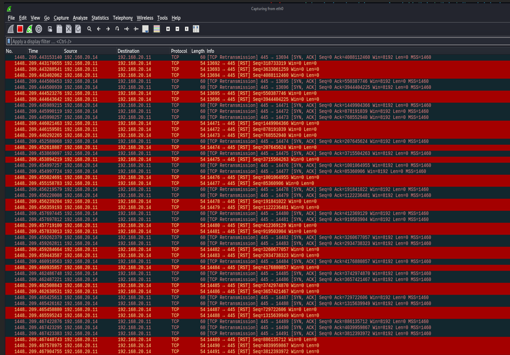
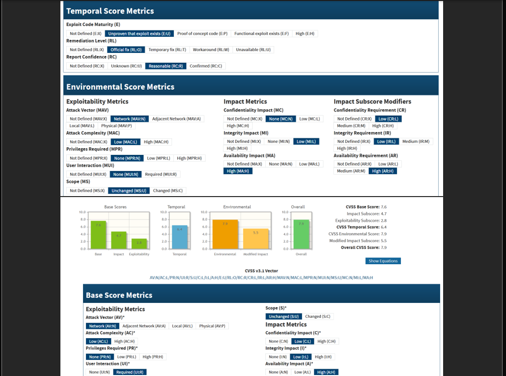
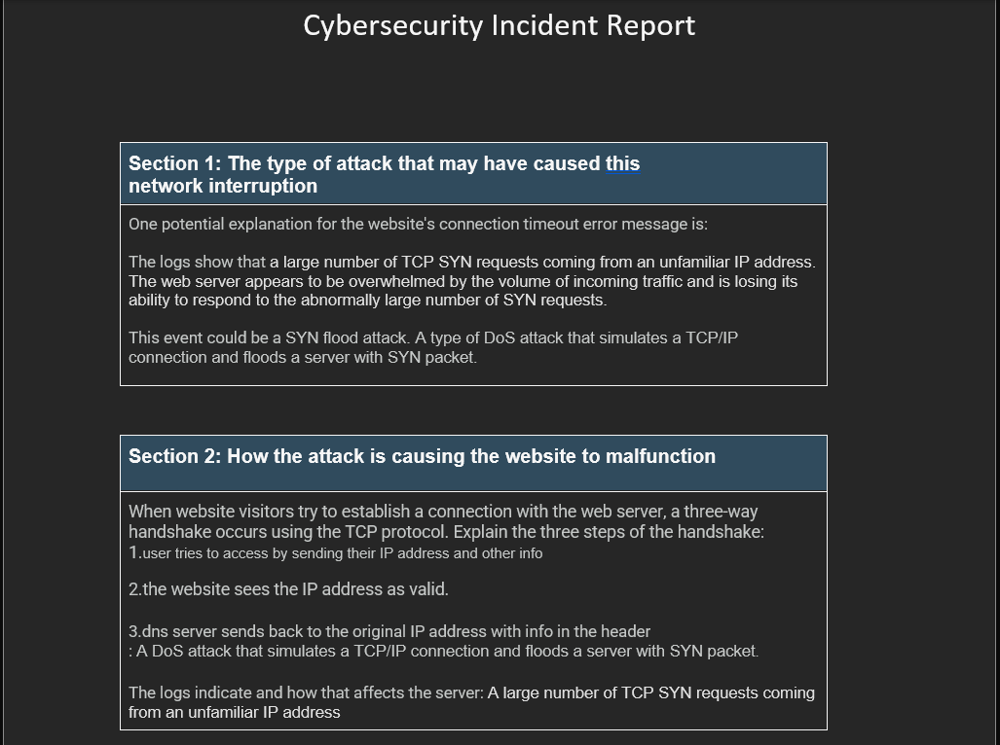

# University Incident Response Case Study

## Incident Response and Network Security Investigation

This project documents an academic cybersecurity investigation in which I acted as a member of an incident response team investigating abusive email activity and a university website outage in a controlled lab environment.

## Project Summary

The scenario involved reported abusive and threatening emails sent to a university staff member, along with a website availability issue that suggested possible malicious activity. My role was to investigate the incident by gathering evidence, analyzing email-related details, performing network reconnaissance, reviewing potential vulnerabilities, simulating attack activity in a controlled lab setting, and documenting findings in a report.

## What I Did

- Investigated reported email abuse indicators
- Performed network discovery and host identification
- Conducted vulnerability assessment activities
- Simulated a denial-of-service style attack in a controlled lab environment
- Captured and reviewed network traffic in Wireshark
- Documented findings in an incident investigation report

## Skills Demonstrated

- Incident response
- Network reconnaissance
- Vulnerability assessment
- Packet analysis
- Technical documentation
- Cybersecurity investigation workflow

## Tools Used

- Kali Linux
- VirtualBox
- Windows 10
- Nmap
- hping3
- Wireshark
- ifconfig
- route

## Environment

- Controlled academic lab
- Isolated test systems
- University case-study scenario

## Repository Contents

- `README.md` — overview of the project, investigation workflow, findings, and recommendations
- `assets/images/` — screenshots and visual evidence used throughout the walkthrough

This repository is organized as a case-study style incident response project, with supporting screenshots included directly in the repository for long-term accessibility and review.

## Investigation Walkthrough

This section shows how I approached the incident from initial intake through technical investigation and final reporting.

---

### 1) Incident Intake and Case Context

The investigation began with a report involving threatening and abusive emails sent to a university staff member, along with a separate website outage that raised concern about possible malicious activity. At this stage, the goal was to understand the reported events, identify available evidence, and determine what systems or communications required investigation.

**Evidence reviewed:**
- Initial case notes
- Staff member details
- Incident background information



---

### 2) Email-Related Evidence Review

I reviewed the email-related details provided in the scenario to better understand the reporting party, the context of the communication, and whether the incident appeared isolated or related to broader malicious activity.

**Focus areas:**
- Reported sender/recipient details
- Possible harassment indicators
- Relevance of communication to the larger incident timeline



---

### 3) Network Discovery and Host Identification

To establish visibility into the target environment, I performed basic network discovery and host identification within the lab. This helped identify active systems and supported later investigation steps.

**Example commands used:**
```bash
route
ifconfig
sudo nmap -PR -sn 192.168.20.0/24
```


### 4) Controlled Availability Attack Simulation in Lab

To better understand how service disruption could affect the university website, I performed a denial-of-service style simulation in a controlled academic lab environment. This helped demonstrate how traffic flooding could impact availability and what related traffic might look like during packet analysis.

**Example command used:**
```bash
sudo hping3 -S --flood -V -p 135 192.168.20.14
```


**Lab objective:**
- Observe service disruption behavior
- Generate traffic for packet capture review
- Support incident analysis and reporting

> **Note:** This project was performed in an authorized academic lab environment for educational purposes.

---

### 5) Packet Capture and Traffic Analysis

After generating lab traffic, I reviewed packet capture data in Wireshark to observe how the simulated activity appeared on the network. This step supported analysis of abnormal traffic patterns and reinforced how packet evidence can be used during incident investigations.

**What I looked for:**
- Unusual packet volume
- Repeated connection attempts
- Indicators of service abuse affecting availability



---

### 6) Vulnerability and Risk Context

I reviewed vulnerability scoring information to help frame the seriousness of the attack scenario and communicate risk in a way that supports decision-making and reporting.

**Why this mattered:**
- Helped communicate severity
- Supported prioritization
- Added context to the overall incident assessment



---

### 7) Final Incident Reporting

The final step was documenting the investigation, findings, and technical observations in a report format. This is an important part of cybersecurity work because strong documentation helps communicate what happened, what was analyzed, and what actions should follow.

**Deliverables included:**
- Investigation notes
- Technical findings
- Supporting screenshots and evidence
- Incident report summary



---

## Key Findings

- Identified suspicious and abusive email activity within the case scenario
- Established visibility into the lab environment through host discovery and network scanning
- Demonstrated how traffic flooding could impact service availability in a controlled academic lab
- Observed abnormal traffic behavior through packet capture analysis in Wireshark
- Documented investigative steps and technical observations in a structured incident report

## Recommendations

- Improve monitoring and alerting for unusual traffic spikes and availability issues
- Strengthen email reporting and evidence collection procedures for harassment-related incidents
- Apply security hardening and availability protections to internet-facing systems
- Maintain clear incident documentation to support repeatable investigations and response efforts
- Continue using packet analysis and host discovery techniques to support future investigations

## What I Learned

This project strengthened my understanding of incident response workflow, network reconnaissance, packet analysis, and technical documentation. It also reinforced the importance of organizing findings clearly so that evidence can support analysis, reporting, and future security recommendations.

